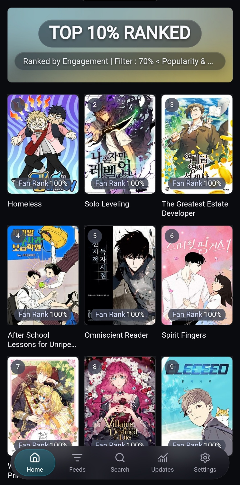

  

<h1 align="center">Aeon Catalogue</h1>

  The catalogue and daily data pipeline used by Aeon.

  
  
  

## About

This repository collects, normalizes, validates, and publishes the data used by the [Aeon manhwa discovery app](https://github.com/zerodox9000-eng/Manhwa_pwa).

It provides:

- Primary titles, aliases, creators, covers, publication details, and source links.
- Genres, themes, detailed tags, content information, and tag hierarchy.
- AniList popularity, favourites, and score information for matched titles.
- Historical snapshots used by growth and recent-change feeds.
- Compact frontend releases prepared for Aeon's search, feeds, and title pages.

  

## Updates

The catalogue is refreshed by a daily GitHub Actions pipeline. New and changed records are normalized, matched with available audience information, recorded in history, validated, and then published for Aeon.

Frontend releases are stored under `db/exports/frontend/`. Raw collection files and pipeline state remain internal to this repository.

## Fan Rank

Fan Rank compares favourites with popularity, adjusts for confidence at different audience sizes, and ranks the result as a percentile across AniList-mapped manhwa with the required statistics.

## Data sources

  
  
  
  

MangaBaka is the main source for catalogue records, covers, publication details, links, and tags. AniList supplies popularity, favourites, and score information for matched titles. MangaUpdates and Anime-Planet may be retained as reference links when available.

Source data and artwork remain the property of their respective services, publishers, and creators.

## Project

Aeon and its catalogue are open-source projects created and maintained by [ZERO_DOX](https://www.reddit.com/u/ZERO_DOX/).

Maintainer documentation is available in [PIPELINE.md](./PIPELINE.md), [FRONTEND_DATA.md](./FRONTEND_DATA.md), and [ARCHITECTURE.md](./ARCHITECTURE.md). Before editing, read [AGENTS.md](./AGENTS.md) and the closest child instructions for the affected area.
